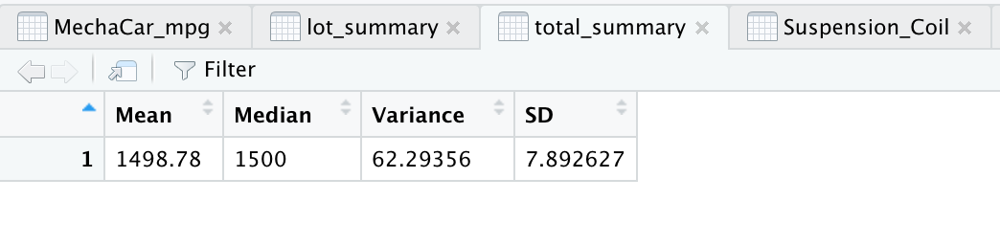

The MechaCar is dealing with production issues which is putting the manufacturing team's progess at a disadvantage. To identify the underlying cause and provide an objective insight, it is decided to look into production data with data analytics team.

## Deliverable 1: Perform Linear Regression to Predict MPG
 

 

## Deliverable 2: Summary Statistics on Suspension Coils
 

 

 

# Deliverable 3: T-Test on Suspension Coils
 

 

 

 
# Deliverable 4: Design a Study Comparing the MechaCar to the Competition